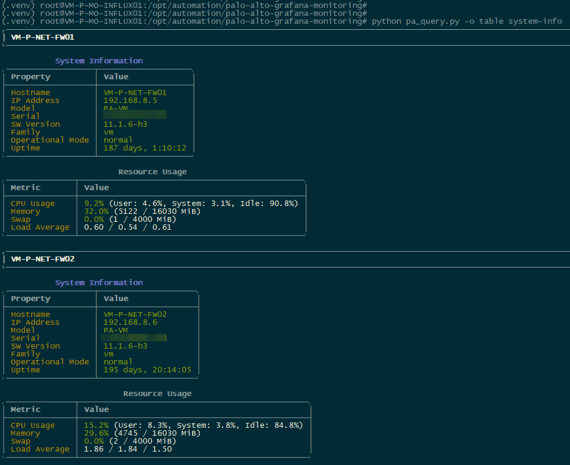
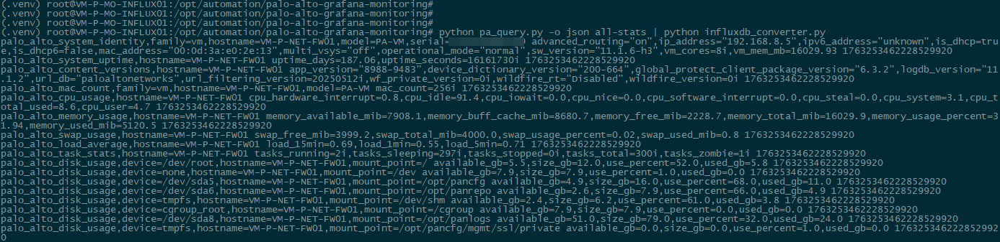
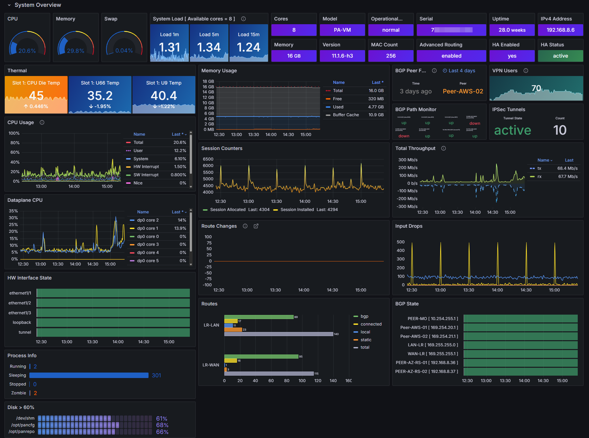
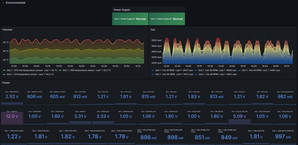
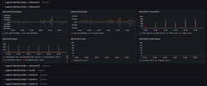
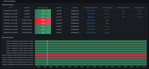
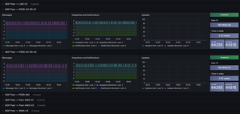
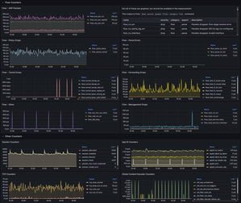
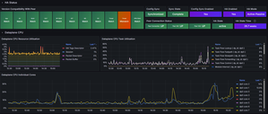
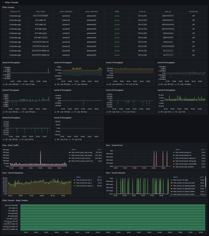

# Palo Alto Networks Grafana Monitoring Tool

A Python-based read-only monitoring tool for Palo Alto Networks firewalls that queries statistics and counters for Grafana integration. The tool focuses on network monitoring, threat protection statistics, system resources, and BGP routing information among other things.

## Table of Contents

- [TL;DR - Quick Start Guide to Dashboard](#tldr---quick-start-guide-to-dashboard)
  - [Quick setup](#quick-setup)
  - [Verify Data Collection and Line Protocol Conversion](#verify-data-collection-and-line-protocol-conversion)
  - [Configure Telegraf for Ingestion](#configure-telegraf-for-ingestion)
  - [Dashboard Preview](#dashboard-preview)
- [Terminal Traffic Viewer](#terminal-traffic-viewer)
  - [Quick Start](#quick-start)
- [Features](#features)
- [Architecture](#architecture)
  - [High-Level Architecture](#high-level-architecture)
- [Installation and Setup](#installation-and-setup)
  - [Prerequisites](#prerequisites)
  - [Installation](#installation)
  - [Basic Usage](#basic-usage)
    - [Output Formats](#output-formats)
    - [Query All (Enabled) Statistics](#query-all-enabled-statistics)
    - [Query Specific Modules](#query-specific-modules)
    - [Convert to InfluxDB Line Protocol](#convert-to-influxdb-line-protocol)
- [InfluxDB Integration](#influxdb-integration)
  - [Features](#features-1)
  - [Usage Examples](#usage-examples)
  - [Workflow](#workflow)
  - [Output Format](#output-format)
  - [Data Processing](#data-processing)
  - [Integration with Grafana](#integration-with-grafana)
  - [InfluxDB Configuration Guide](#influxdb-configuration-guide)
- [Schema Analysis and Documentation](#schema-analysis-and-documentation)
  - [What is the Schema?](#what-is-the-schema)
  - [Generating the Schema](#generating-the-schema)
  - [When to Generate the Schema](#when-to-generate-the-schema)
  - [Schema Output Example](#schema-output-example)
  - [Using the Schema](#using-the-schema)
  - [InfluxDB Measurements Reference](#influxdb-measurements-reference)
  - [Complete Workflow](#complete-workflow)
- [Configuration](#configuration)
  - [Firewall Configuration](#firewall-configuration)
  - [Module Configuration](#module-configuration)
  - [Per-Firewall Overrides](#per-firewall-overrides)
- [Available Modules](#available-modules)
  - [System Module](#system-module)
  - [Network Interfaces Module](#network-interfaces-module)
  - [Routing Module](#routing-module)
  - [Global Counters Module](#global-counters-module)
  - [GlobalProtect Module](#globalprotect-module)
  - [VPN Tunnels Module](#vpn-tunnels-module)
- [Command Line Interface](#command-line-interface)
  - [Main Query Tool](#main-query-tool)
  - [InfluxDB Converter](#influxdb-converter)
- [Examples](#examples)
  - [Basic Monitoring Setup](#basic-monitoring-setup)
  - [Automated Collection](#automated-collection)
  - [Grafana Dashboard Setup](#grafana-dashboard-setup)
- [Troubleshooting](#troubleshooting)
  - [Common Issues](#common-issues)
  - [Debug Mode](#debug-mode)
  - [Log Files](#log-files)
- [Development](#development)
  - [Project Structure](#project-structure)
  - [Testing](#testing)
- [License](#license)

## TL;DR - Quick Start Guide to Dashboard

### Quick setup
1. Clone the repository:
```bash
git clone https://github.com/senses0/palo-alto-grafana-monitoring
cd palo-alto-grafana-monitoring
```

2. Create and activate a virtual environment:
```bash
python -m venv venv
source venv/bin/activate 
```

3. Install dependencies:
```bash
pip install -r requirements.txt
```

4. Configure your firewalls:
```bash
cp config/config.yaml.example config/config.yaml
# Edit config/config.yaml with your firewall details
```

### Verify Data Collection and Line Protocol Conversion

Verify that data can be collected from the firewall(s) defined in the config file by running the following command. This should produce a tabular summary output for each firewall defined in the config:

```bash
(venv) user@localhost:/path/to/palo-alto-grafana-monitoring$ python pa_query.py -o table system-info
```


Now that we know the script can successfully gather data from the Palo Alto XML API, verify the InfluxDB line protocol conversion by running:

```bash
(venv) user@localhost:/path/to/palo-alto-grafana-monitoring$ python pa_query.py -o json all-stats | python influxdb_converter.py 
```



### Configure Telegraf for Ingestion

> ⚠️ The Telegraf user should have read/write access to the following files/locations:
* `/path/to/palo-alto-grafana-monitoring/logs`
* `/path/to/palo-alto-grafana-monitoring/config/hostname_cache.json`


> ⚠️ **CAUTION**: If you have a colossal routing table (like the entire internet BGP table, for example), you may want to exercise caution. This scenario was not covered in my testing. You may want to adjust the "interval" if 60 seconds is not enough for data collection, or disable route collection completely if it is resource intensive. (_See [Configuration](#configuration) section for details_)

```
$ cat /etc/telegraf/telegraf.d/inputs_palo_alto.conf 
```

```bash
[[inputs.exec]]
  ## Command to run
  commands = [
   "/bin/bash -c 'cd /path/to/palo-alto-grafana-monitoring && /path/to/palo-alto-grafana-monitoring/.venv/bin/python pa_query.py -o json all-stats | /path/to/palo-alto-grafana-monitoring/.venv/bin/python influxdb_converter.py'"
  ]
  
  ## Timeout for the command to complete
  timeout = "60s"
  
  ## Data format to consume (influx = line protocol)
  data_format = "influx"
  
  ## Collection interval
  interval = "1m"
```

### Dashboard Preview

Import the dashboard:

* From grafana.com [https://grafana.com/grafana/dashboards/24401-palo-alto-dashboard](https://grafana.com/grafana/dashboards/24401-palo-alto-dashboard)
* Or from JSON schema [`grafana/palo_alto_dashboard.json`](grafana/palo_alto_dashboard.json)

You can select the data source for the dashboard at the time of import or from the dropdown list at the top after importing.

> ⚠️ If you are ingesting data to InfluxDB2.x/3.x, you need to configure DBRP for "telegraf" bucket. The data source should be added to Grafana as an InfluxQL data source. See [influxdb_configuration.md](docs/influxdb_configuration.md) for more details.



|  |  |  |  |
|-----------|-----------|-----------|-----------|
| **Environmental**  | **Interfaces Overview**  | **Interface Stats**  | **BGP Path Monitor** |
| [](docs/images/dashboard-environmental.png)| [](docs/images/dashboard-interfaces-overview.png)| [](docs/images/dashboard-interface-stats.png)| [](docs/images/dashboard-bgp-path-monitor.png)<br> |
| ‎  |  |  |  |
| **BGP Peer Status**  | **Counters** | **HA Status and Dataplane CPU** | **IPSec Tunnels** |
| [](docs/images/dashboard-bgp-peer-stats.png) | [](docs/images/dashboard-counters.png) | [](docs/images/dashboard-ha-status-and-dataplane-cpu.png) | [](docs/images/dashboard-ipsec-tunnels.png) |
|  |  |  |  |


## Terminal Traffic Viewer

A real-time CLI traffic viewer for Palo Alto firewall interfaces. Built with the [Textual](https://github.com/Textualize/textual) TUI framework, it provides interactive interface selection and live ASCII traffic graphs.

### Quick Start

1. **Update dependencies** (if you recently did a `git pull`):
```bash
pip install -r requirements.txt
```

2. **Test connectivity** to verify interface data retrieval:
```bash
python traffic_viewer.py --test
```

3. **Run the traffic viewer**:
```bash
python traffic_viewer.py
```

https://github.com/senses0/palo-alto-grafana-monitoring/raw/main/docs/images/traffic-view-demo-33.mp4


## Features

- **Multi-Firewall Support**: Monitor multiple firewalls simultaneously
- **Comprehensive Statistics**: Collect system, environmental, interface, routing, GlobalProtect, VPN, and counter data
- **Beautiful Table Output**: Rich, colorful tables with visual indicators for human-readable output
- **InfluxDB Integration**: Convert all data to InfluxDB line protocol format for time-series monitoring
- **Configurable Collection**: Enable/disable specific modules and collections per firewall
- **Read-Only Operations**: Safe monitoring without configuration changes
- **API Key Authentication**: Secure authentication using API keys only
- **Structured Logging**: Comprehensive logging with rotation and configurable levels
- **Hardware and VM Firewalls**: Supports both hardware and VM firewalls (Tested against PAN OS `11.1.6-h3`. Probably works with some older versions)
- **Advanced and Legacy Routing mode**: Supports both Advanced Routing and Legacy Routing in Palo Alto Firewalls

## Architecture

Comprehensive architecture documentation is available in the [`docs/`](docs/) directory:

- **[Architecture Overview](docs/architecture.md)** - Complete system architecture with detailed diagrams
  - System architecture and data flow
  - Component relationships and interactions
  - Deployment patterns and strategies
  - Module interactions and statistics coverage
  - Performance characteristics and scaling guidelines

- **[Quick Reference Diagrams](docs/diagrams-quick-reference.md)** - At-a-glance workflows and use cases
  - Quick start flows and common commands
  - Deployment patterns (Cron, Systemd, Docker)
  - Troubleshooting flowcharts
  - Multi-firewall collection patterns

- **[InfluxDB Configuration Guide](docs/influxdb_configuration.md)** - Complete InfluxDB setup for all versions
  - InfluxDB 1.x vs 2.x/3.x/Cloud differences
  - DBRP mapping for InfluxQL support
  - Grafana integration and data source setup

### High-Level Architecture

```
┌─────────────────────────────────────────────────────────────────┐
│                    Palo Alto Firewalls                          │
│              (Multiple firewalls via REST API)                  │
└────────────────────────┬────────────────────────────────────────┘
                         │ HTTPS (Port 443)
                         │ API Key Authentication
                         ▼
┌─────────────────────────────────────────────────────────────────┐
│                  PaloAltoClient (Multi-Firewall)                │
│        - Concurrent collection via ThreadPoolExecutor           │
│        - Retry logic with exponential backoff                   │
│        - XML parsing and error handling                         │
│        - Hostname caching with configurable TTL                 │
└────────────────────────┬────────────────────────────────────────┘
                         │
                         ▼
┌─────────────────────────────────────────────────────────────────┐
│                    Statistics Collectors                        │
│   ┌────────────┬──────────────┬────────────┬──────────────┐     │
│   │   System   │  Interfaces  │  Routing   │   Counters   │     │
│   │            │              │            │              │     │
│   │ - CPU      │ - Hardware   │ - BGP      │ - Sessions   │     │
│   │ - Memory   │ - Logical    │ - Static   │ - Packets    │     │
│   │ - Disk     │ - Counters   │ - Routes   │ - Threats    │     │
│   │ - HA       │              │ - Advanced │ - Flow       │     │
│   │ - Extended │              │ - Legacy   │ - Management │     │
│   └────────────┴──────────────┴────────────┴──────────────┘     │
│   ┌────────────────────────┬─────────────────────────────┐      │
│   │   GlobalProtect        │        VPN Tunnels          │      │
│   │  - Gateway stats       │      - IPSec SA             │      │
│   │  - Portal stats        │      - VPN flows            │      │
│   │  - Gateway summary     │      - VPN gateways         │      │
│   │  - Portal summary      │      - Active tunnels       │      │
│   └────────────────────────┴─────────────────────────────┘      │
│   ┌─────────────────────────────────────────────────────┐       │
│   │              Environmental                          │       │
│   │    - Thermal sensors  - Fan speeds                  │       │
│   │    - Power supplies   - Power consumption           │       │
│   └─────────────────────────────────────────────────────┘       │
└────────────────────────┬────────────────────────────────────────┘
                         │
                         ▼
┌──────────────────────────────────────────────────────────────────┐
│                        Output Formats                            │
│    ┌─────────────────────┬─────────────────────────────────┐     │
│    │   JSON Output       │   Rich Table Output             │     │
│    │  (Machine-readable) │   (Colorful, visual indicators) │     │
│    └──────────┬──────────┴─────────────────────────────────┘     │
└───────────────┼──────────────────────────────────────────────────┘
                │
                ▼
┌─────────────────────────────────────────────────────────────────┐
│              InfluxDB Converter (Line Protocol)                 │
│  - Transforms JSON to InfluxDB line protocol                    │
│  - 42 measurements across 7 categories                          │
│  - Proper tagging and field types                               │
│  - Smart routing normalization (advanced/legacy)                │
└────────────────────────┬────────────────────────────────────────┘
                         │
                         ▼
┌─────────────────────────────────────────────────────────────────┐
│                    InfluxDB (Time-Series DB)                    │
│              - Stores metrics with timestamps                   │
│              - Efficient query performance                      │
└────────────────────────┬────────────────────────────────────────┘
                         │
                         ▼
┌─────────────────────────────────────────────────────────────────┐
│                   Grafana Dashboards                            │
│           - Real-time monitoring and visualization              │
│           - Alerting and anomaly detection                      │
└─────────────────────────────────────────────────────────────────┘
```

For detailed architecture diagrams and deployment strategies, see the [Architecture Documentation](docs/architecture.md).

## Installation and Setup

### Prerequisites

- Python 3.8 or higher
- Palo Alto Networks firewall with API access
- API key for authentication (⚠️ Use an API key that only has read-only capability)
- InfluxDB backend. (⚠️ If you are using InfluxDB 2.x/3.x or InfluxDB Cloud variation, you will have to create [InfluxDB v1 DBRP mapping](https://docs.influxdata.com/influxdb/v2/reference/cli/influx/v1/dbrp/create/) for your bucket (_See also: [influxdb_configuration.md](docs/influxdb_configuration.md) for more details_). This will allow InfluxQL queries against the database/bucket. The dashboard included here uses InfluxQL)

### Installation

1. Clone the repository:
```bash
git clone https://github.com/senses0/palo-alto-grafana-monitoring
cd palo-alto-grafana-monitoring
```

2. Create and activate a virtual environment:
```bash
python -m venv venv
source venv/bin/activate 
```

3. Install dependencies:
```bash
pip install -r requirements.txt
```

4. Configure your firewalls:
```bash
cp config/config.yaml.example config/config.yaml
# Edit config/config.yaml with your firewall details
```

### Basic Usage

#### Output Formats

The tool supports two output formats:

**Table Format** (Recommended for human viewing):
- Beautiful, colorful tables with visual indicators
- Color-coded metrics (green=healthy, yellow=warning, red=critical)
- Easy to read and understand at a glance
- Perfect for terminal viewing and quick checks

**JSON Format** (Recommended for automation):
- Complete data structure
- Machine-readable
- Suitable for piping to other tools and InfluxDB conversion

#### Query All (Enabled) Statistics

```bash
# Human-readable table output (all firewalls in the config)
python pa_query.py --output table all-stats

# Human-readable table output (target a specific firewall)
python pa_query.py --firewall=FW-TEST01 --output table all-stats

# Machine-readable JSON output
python pa_query.py --output json all-stats
```

#### Query Specific Modules

```bash
# Table output with colors (great for terminal viewing)
python pa_query.py --output table system-info
python pa_query.py --output table interface-stats
python pa_query.py --output table routing-info
python pa_query.py --output table global-counters
python pa_query.py --output table global-protect
python pa_query.py --output table vpn-tunnels

# JSON output (for automation and InfluxDB conversion)
python pa_query.py --output json system-info
python pa_query.py --output json interface-stats
python pa_query.py --output json routing-info  # Global Routing table, Separate BGP and Static Routes tables
python pa_query.py --output json global-counters
python pa_query.py --output json global-protect
python pa_query.py --output json vpn-tunnels
```

**💡 Pro Tips:**
- Use `--output table` (or `-o table`) for quick visual checks and monitoring
- Use `--output json` (or `-o json`) when piping to InfluxDB converter or other tools
- Save table output to files: `python pa_query.py -o table system-info -f report.txt`

> **Note**: The routing module provides dedicated collections (that can be turned on or off) for BGP and Static Routes. Other routing protocols (OSPF, RIP, EIGRP, etc.) are not queried at the individual protocol level, but routes from these protocols will appear in the `routing_table` collection when enabled.

#### Convert to InfluxDB Line Protocol
```bash
# First, collect data from pa_query.py
python pa_query.py -o json all-stats > stats.json

# Convert to InfluxDB format
python influxdb_converter.py --input stats.json

# Or pipe directly from pa_query.py
python pa_query.py -o json all-stats | python influxdb_converter.py

# Save to file
python pa_query.py -o json all-stats | python influxdb_converter.py --output data.txt
```

## InfluxDB Integration

The `influxdb_converter.py` script converts firewall statistics from `pa_query.py all-stats` JSON output to InfluxDB line protocol format. This enables seamless integration with Grafana for time-series monitoring and visualization.

**Important Notes**:
- The converter expects the specific JSON structure produced by `pa_query.py -o json all-stats`
- **Tag Structure**: All measurements use `hostname` tags (the firewall's actual hostname from system data) instead of firewall config names. This provides consistent identification across your infrastructure.

### Features

- **Comprehensive Data Conversion**: Converts data from all available modules in the pa_query.py output
- **Multi-Firewall Support**: Processes all firewalls included in the data
- **Schema-Driven Design**: Converts data from these modules:
  - **System**: System info, resource usage, disk usage, HA status, dataplane CPU
  - **Environmental**: Thermal sensors, fan speeds, power supplies, power consumption
  - **Network Interfaces**: Interface info and counters (hardware and logical)
  - **Routing**: BGP peer status, path monitor, routing table counts
  - **Global Counters**: Global counter statistics by category
  - **GlobalProtect**: Gateway and portal statistics
  - **VPN Tunnels**: Tunnel info, flows, gateways, IPsec SA details

### Usage Examples

#### Basic Conversion
```bash
# Collect data and convert in one step
python pa_query.py -o json all-stats | python influxdb_converter.py
```

#### Save to File
```bash
# Save converted data to a file
python pa_query.py -o json all-stats > stats.json
python influxdb_converter.py --input stats.json --output palo_alto_metrics.txt
```

#### Verbose Output
```bash
# Enable detailed logging
python influxdb_converter.py --input stats.json --verbose
```

### Workflow

The typical workflow for using the converter:

1. **Collect data** from your firewalls using `pa_query.py`
2. **Convert to InfluxDB format** using `influxdb_converter.py`
3. **Import to InfluxDB** for storage and visualization using Telegraf


### Output Format

The converter generates InfluxDB line protocol format data points. Each data point includes:

- **Measurement**: Descriptive name (e.g., `palo_alto_system_identity`, `palo_alto_interface_counters`)
- **Tags**: Key-value pairs for filtering and grouping (hostname, interface name, etc.)
- **Fields**: Numeric and string values (counters, status, etc.)
- **Timestamp**: Nanosecond precision timestamp

Example output:
```
palo_alto_system_identity,family=vm,hostname=VM-D-FW01,model=PA-VM,serial=732CG0C853BD29B sw_version="11.1.6-h3",vm_cores=4i,vm_mem_mb=13.69 1755998507027344896
palo_alto_cpu_usage,hostname=VM-D-FW01 cpu_user=12.1,cpu_system=6.1,cpu_idle=78.8,cpu_total=21.2 1755998507027344896
palo_alto_interface_counters,hostname=VM-D-FW01,interface=ethernet1/1 rx_octets=1234567i,tx_octets=9876543i,rx_packets=1000i,tx_packets=2000i 1755998507027344896
```

### Data Processing

The converter processes the JSON data from pa_query.py:

- **Module Detection**: Automatically processes all modules present in the input data
- **Multi-Firewall Support**: Handles data from multiple firewalls in a single conversion
- **Error Handling**: Gracefully handles missing data and conversion errors
- **Flexible Input**: Accepts input from files or stdin (pipe)

### Integration with Grafana

1. **Set up InfluxDB**: Configure InfluxDB to receive the line protocol data
2. **Configure Data Source**: Add InfluxDB as a data source in Grafana
3. **Create Dashboards**: Use the measurement names and tags to create dashboards
4. **Schedule Collection**: Set up regular data collection using cron or similar

Example Grafana query:
```sql
SELECT mean("cpu_total") FROM "palo_alto_cpu_usage" 
WHERE time > now() - 1h 
GROUP BY "hostname", time(5m)
```

### InfluxDB Configuration Guide

For detailed instructions on setting up InfluxDB and configuring it for Grafana integration, see:
- **[InfluxDB Configuration Guide](docs/influxdb_configuration.md)** - Complete setup guide for all InfluxDB versions
  - InfluxDB 1.x setup (native InfluxQL support)
  - InfluxDB 2.x/3.x/Cloud setup with DBRP mapping
  - Understanding DBRP (Database/Retention Policy) mapping

**Important**: If using InfluxDB 2.x, 3.x, or Cloud, you **must create a DBRP mapping** before InfluxQL queries will work in Grafana. See the configuration guide for step-by-step instructions.

## Schema Analysis and Documentation

The `data_analyzer.py` tool analyzes your firewall's data structure and generates comprehensive schema documentation for all measurements that will be created by the InfluxDB converter.

### What is the Schema?

The schema documentation describes:
- All unique measurements (e.g., `palo_alto_cpu_usage`, `palo_alto_bgp_peer`)
- Tags (dimensions) for filtering and grouping
- Fields (metrics) with data types and units
- Data point cardinality and update frequency
- Example values from your actual data

### Generating the Schema

```bash
# Analyze data from a JSON file (simple positional argument)
python data_analyzer.py complete_stats.json

# Or use the --input flag
python data_analyzer.py --input complete_stats.json

# Direct pipe from pa_query.py (no intermediate file needed)
python pa_query.py -o json all-stats | python data_analyzer.py

# Export to JSON for documentation
python data_analyzer.py complete_stats.json --export influxdb_schema.json

# Or with --input flag
python data_analyzer.py --input complete_stats.json --export influxdb_schema.json

# Pipe and export in one command
python pa_query.py -o json all-stats | python data_analyzer.py --export influxdb_schema.json
```

### When to Generate the Schema

You should generate/update the schema when:

1. **First Setup**: To understand what metrics will be collected
2. **Adding Modules**: When enabling new modules in your configuration
3. **Troubleshooting**: To verify data structure and conversion logic
4. **Dashboard Planning**: Before creating Grafana dashboards
5. **Documentation**: To share the data model with your team

### Schema Output Example

The analyzer provides a beautiful formatted output showing each measurement:

```
╭────────────────────────────── Analysis Summary ──────────────────────────────╮
│ Total Unique Measurements: 42                                                │
│                                                                              │
│ By Category:                                                                 │
│   • system: 13 unique measurements                                           │
│   • environmental: 4 unique measurements                                     │
│   • interfaces: 4 unique measurements                                        │
│   • routing: 4 unique measurements                                           │
│   • counters: 10 unique measurements                                         │
│   • globalprotect: 2 unique measurements                                     │
│   • vpn: 5 unique measurements                                               │
╰──────────────────────────────────────────────────────────────────────────────╯

palo_alto_cpu_usage
  Tags: hostname
  Fields: cpu_user, cpu_system, cpu_idle, cpu_total_used (all in %)
  Description: CPU utilization breakdown by type
```

### Using the Schema

The schema JSON file serves as:
- **Documentation**: Reference for all available measurements
- **Planning**: Design Grafana dashboards before implementation
- **Validation**: Verify converter output matches expectations
- **Communication**: Share data model with team members

**Note**: The schema JSON is documentation only. The converter has its conversion logic built-in and does not read the schema file at runtime.

### InfluxDB Measurements Reference

For comprehensive documentation of all InfluxDB measurements, tags, and fields, see:
- **[InfluxDB Measurements Reference](docs/influxdb_measurements.md)** - Complete catalog of 42 measurements
  - Detailed tables for all tags and fields
  - Data types, units, and descriptions
  - Grafana query examples
  - Organized by category (System, Environmental, Interfaces, Routing, Counters, GlobalProtect, VPN)

### Complete Workflow

```bash
# Step 1: Collect data from your firewall
python pa_query.py -o json all-stats > my_stats.json

# Step 2: Analyze the data structure
python data_analyzer.py my_stats.json --export my_schema.json

# Step 3: Review the schema (optional)
cat my_schema.json

# Step 4: Convert to InfluxDB format
python influxdb_converter.py -i my_stats.json -o metrics.txt

# Step 5: Import to InfluxDB
influx write --bucket mybucket --file metrics.txt
```

**Alternative: Streamlined workflow with piping** (no intermediate files):

```bash
# Analyze schema directly from live data
python pa_query.py -o json all-stats | python data_analyzer.py --export my_schema.json

# Or convert directly to InfluxDB format
python pa_query.py -o json all-stats | python influxdb_converter.py | influx write --bucket mybucket
```

## Configuration

### Firewall Configuration

Edit `config/config.yaml` to configure your firewalls:

```yaml
firewalls:
  primary-fw:
    enabled: true  # Set to false to disable polling (default: true)
    host: "firewall.example.com"
    port: 443
    api_key: "your-api-key-here"
    verify_ssl: true
    timeout: 30
    description: "Primary production firewall"
    location: "Data Center 1"
    routing_mode: "auto"  # auto, advanced, or legacy
    
  # Example: Temporarily disabled firewall
  maintenance-fw:
    enabled: false  # This firewall will not be polled
    host: "maintenance-fw.example.com"
    port: 443
    api_key: "your-api-key-here"
    verify_ssl: true
    timeout: 30
    description: "Firewall under maintenance"
    location: "Data Center 2"
```

**Configuration Parameters:**

| Parameter | Required | Default | Description |
|-----------|----------|---------|-------------|
| `enabled` | No | `true` | Enable/disable polling for this firewall |
| `host` | Yes | - | Firewall hostname or IP address |
| `port` | No | `443` | API port |
| `api_key` | Yes | - | API key for authentication |
| `verify_ssl` | No | `true` | Enable SSL certificate verification |
| `timeout` | No | `30` | Request timeout in seconds |
| `description` | No | - | Human-readable description |
| `location` | No | - | Physical or logical location |
| `routing_mode` | No | `auto` | Routing mode: `auto`, `advanced`, or `legacy` |

### Module Configuration

Control which statistics are collected:

```yaml
stats_collection:
  enabled_modules:
    - system
    - network_interfaces
    - routing
    - global_counters
    - global_protect
    - vpn_tunnels
  
  modules:
    system:
      enabled: true
      collections:
        system_info: true
        resource_usage: true
        disk_usage: true
        ha_status: true
```

### Per-Firewall Overrides

Override settings for specific firewalls:

```yaml
firewall_overrides:
  secondary-fw:
    routing:
      enabled: false  # Disable routing for this firewall
    system:
      collections:
        hardware_info: false  # Disable specific collections
```

## Available Modules

### System Module
- **system_info**: System identity, network configuration, software versions
- **resource_usage**: CPU, memory, load average, uptime, task statistics
- **disk_usage**: Disk space usage for all mount points
- **ha_status**: High availability status and configuration
- **environmental**: Thermal sensors, fan speeds, power supplies, power consumption
- **extended_cpu**: Per-core CPU statistics and detailed resource monitor data

### Network Interfaces Module
- **interface_info**: Interface configuration, state, IP addresses
- **interface_counters**: Traffic statistics, errors, discards

### Routing Module

**Supported Protocols**: BGP and Static Routes

The routing module provides dedicated collections (that can be turned on or off) for BGP and Static Routes. Other routing protocols (OSPF, RIP, EIGRP, etc.) are not queried at the individual protocol level, but routes from these protocols will appear in the `routing_table` collection when enabled.

- **bgp_summary**: BGP routing summary statistics
- **bgp_peer_status**: Individual BGP peer status and statistics
- **bgp_routes**: BGP-specific routes
- **static_routes**: Static route information
- **routing_table**: Complete routing table (includes all protocols: BGP, Static, OSPF, RIP, etc.)

### Global Counters Module
- **global_counters**: System-wide counter statistics
- **session_info**: Session and connection statistics

### GlobalProtect Module
- **gateway_summary**: GlobalProtect gateway summary
- **gateway_statistics**: Per-gateway statistics
- **portal_statistics**: Portal authentication and session statistics
- **portal_summary**: Portal configuration summary

### VPN Tunnels Module
- **vpn_tunnels**: VPN tunnel status and statistics
- **ipsec_sa**: IPsec security association information
- **vpn_flows**: VPN flow statistics
- **vpn_gateways**: VPN gateway configuration

## Command Line Interface

### Main Query Tool

```bash
# Get all statistics
python pa_query.py all-stats

# Get specific module data
python pa_query.py system-info
python pa_query.py interface-stats
python pa_query.py routing-info
python pa_query.py global-counters
python pa_query.py global-protect
python pa_query.py vpn-tunnels

# Target specific firewall
python pa_query.py --firewall primary-fw system-info

# Output formats
python pa_query.py -o json system-info
python pa_query.py -o table system-info

# Firewall management
python pa_query.py firewall-summary
python pa_query.py validate-config
```

### InfluxDB Converter

```bash
# From JSON file
python influxdb_converter.py --input stats.json

# From stdin (pipe)
python pa_query.py -o json all-stats | python influxdb_converter.py

# Save to file
python influxdb_converter.py --input stats.json --output metrics.txt

# Verbose logging
python influxdb_converter.py --input stats.json --verbose

# Custom timestamp (nanoseconds)
python influxdb_converter.py --input stats.json --timestamp 1234567890000000000
```

## Examples

### Basic Monitoring Setup

1. **Configure firewalls** in `config/config.yaml`
2. **Test connectivity**:
   ```bash
   python pa_query.py validate-config
   ```
3. **Collect and convert data**:
   ```bash
   python pa_query.py -o json all-stats > stats.json
   python influxdb_converter.py --input stats.json --output metrics.txt
   ```
4. **Import to InfluxDB**:
   ```bash
   influx write --bucket palo_alto --file metrics.txt
   ```

### Automated Collection

#### Using [Telegraf](https://www.influxdata.com/time-series-platform/telegraf/) Exec Plugin

Telegraf provides a more robust solution with built-in buffering, retry logic, and direct InfluxDB integration.

##### Configuration

Add this configuration to your Telegraf config file (Example: `/etc/telegraf/telegraf.d/inputs_palo_alto.conf`):

```toml
# Palo Alto Networks Firewall Monitoring
[[inputs.exec]]
  ## Command to run
  commands = [
    "/bin/bash -c 'cd /path/to/palo-alto-grafana-monitoring && /path/to/palo-alto-grafana-monitoring/.venv/bin/python pa_query.py -o json all-stats | /path/to/palo-alto-grafana-monitoring/.venv/bin/python influxdb_converter.py'"
  ]
  
  ## Timeout for the command to complete
  timeout = "60s"
  
  ## Data format to consume (influx = line protocol)
  data_format = "influx"
  
  ## Collection interval
  interval = "1m"
  
```

### Grafana Dashboard Setup

1. **Import data** to InfluxDB using the converter output
2. **Create dashboards** using measurement names like:
   - `palo_alto_cpu_usage`
   - `palo_alto_memory_usage`
   - `palo_alto_interface_counters`
   - `palo_alto_bgp_peer_status`
3. **Use tags** for filtering:
   - `hostname` - The firewall's hostname (primary identifier)
   - `interface` - Interface name (for interface measurements)
   - `peer_name`, `peer_ip` - BGP peer identifiers
   - `gateway_name`, `portal_name` - GlobalProtect identifiers
   - Other measurement-specific tags

## Troubleshooting

### Common Issues

1. **SSL Verification Errors**: Set `verify_ssl: false` in config (not recommended for production)
2. **API Key Issues**: Ensure API key has operational command permissions
3. **Module Not Available**: Some modules may not be available on all firewall models
4. **Connection Timeouts**: Increase timeout value in configuration

### Debug Mode

Enable verbose logging for troubleshooting:

```bash
# Verbose pa_query.py
python pa_query.py --verbose system-info

# Verbose influxdb_converter.py
python pa_query.py -o json all-stats > stats.json
python influxdb_converter.py --input stats.json --verbose
```

### Log Files

Check log files in the `logs/` directory for detailed error information.

## Development

### Project Structure

```
palo-alto-grafana-monitoring/
├── src/
│   ├── palo_alto_client/     # Core API client
│   │   ├── auth.py           # Authentication module
│   │   ├── client.py         # Main client implementation
│   │   └── exceptions.py     # Custom exceptions
│   ├── stats/                # Statistics collectors
│   │   ├── __init__.py
│   │   ├── global_counters.py
│   │   ├── global_protect.py
│   │   ├── network_interfaces.py
│   │   ├── routing.py
│   │   ├── system.py
│   │   └── vpn_tunnels.py
│   ├── traffic_viewer/       # Terminal traffic viewer TUI
│   │   ├── __init__.py
│   │   ├── app.py            # Main application
│   │   ├── constants.py      # Configuration constants
│   │   ├── models.py         # Data models
│   │   ├── screens.py        # UI screens
│   │   ├── styles.py         # CSS styles
│   │   ├── utils.py          # Utility functions
│   │   └── widgets.py        # Custom widgets
│   └── utils/                # Shared utilities
│       ├── cli.py            # CLI helpers
│       ├── logger.py         # Logging configuration
│       ├── parsers.py        # Data parsers
│       ├── stats_config.py   # Stats configuration
│       ├── table_formatters.py  # Table formatting for output
│       └── validators.py     # Input validators
├── config/                   # Configuration management
│   ├── __init__.py
│   ├── config.yaml           # Main configuration file
│   ├── config.yaml.example   # Example configuration
│   ├── hostname_cache.json   # Cached firewall hostnames
│   └── settings.py           # Settings loader
├── docs/                     # Documentation
│   ├── architecture.md       # Architecture documentation
│   ├── diagrams-quick-reference.md  # Quick reference diagrams
│   ├── influxdb_configuration.md    # InfluxDB setup guide
│   ├── influxdb_measurements.md     # Measurements reference
│   ├── README.md             # Documentation index
│   └── images/               # Documentation images and screenshots
├── grafana/                  # Grafana integration
│   └── palo_alto_dashboard.json    # Dashboard template
├── tests/                    # Test suite
│   ├── __init__.py
│   ├── conftest.py           # Pytest fixtures
│   ├── firewall_config.yaml  # Test firewall configuration
│   ├── firewall_config.example.yaml
│   ├── README.md             # Testing documentation
│   └── test_*.py             # Test modules
├── logs/                     # Application logs
│   └── pa_stats.log          # Main log file
├── pa_query.py               # Main CLI tool
├── traffic_viewer.py         # Terminal traffic viewer entry point
├── influxdb_converter.py     # InfluxDB line protocol converter
├── data_analyzer.py          # Schema analysis and documentation tool
├── obfuscate_json.py         # Sensitive data obfuscation for sharing
├── terminal_traffic_viewer.md # Traffic viewer documentation
├── requirements.txt          # Python dependencies
├── pyproject.toml            # Project configuration
├── pytest.ini                # Test configuration
├── LICENSE                   # MIT License
└── README.md                 # This file
```

### Testing

This project has comprehensive test coverage using pytest. Tests run against real firewall hardware for accuracy.

**📚 For complete testing documentation**, including:
- Test configuration and setup
- How to run different test categories
- Test markers and fixtures
- Troubleshooting and debugging
- Security best practices

**See: [tests/README.md](tests/README.md)**

#### Quick Start

```bash
# Activate virtual environment
source venv/bin/activate

# Run all tests
pytest

# Run specific test categories
pytest -m unit              # Unit tests only
pytest -m real_firewall     # Real firewall tests
pytest -m integration       # Integration tests

# Run with HTML coverage report
pytest --cov=src --cov-report=html
# Then open htmlcov/index.html in your browser
```


## License

This project is licensed under the MIT License - see the [LICENSE](LICENSE) file for details.

### What This Means

- ✅ **Free to use** - Commercial or personal use
- ✅ **Modify and distribute** - Fork it, change it, share it
- ✅ **Attribution required** - Keep the copyright notice
- ⚠️ **No warranty** - Use at your own risk
- ⚠️ **No liability** - Authors are not responsible for issues arising from use

**Important**: This tool is designed for read-only monitoring operations. Always test in a non-production environment first and ensure your API keys have appropriate read-only permissions.
