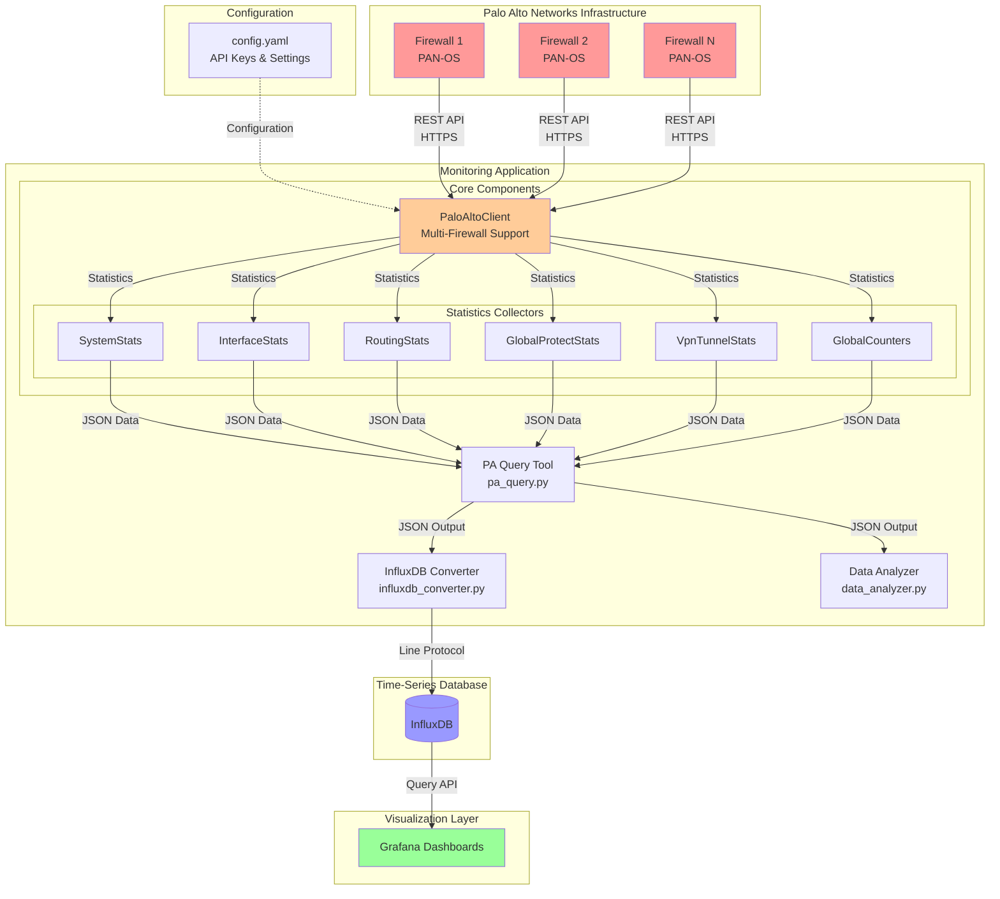

# Architecture Documentation

This document provides comprehensive architecture diagrams for the Palo Alto Grafana Monitoring project.

**Note:** For detailed InfluxDB measurement specifications, see `docs/influxdb_measurements.md`.

## Table of Contents
1. [System Architecture](#system-architecture)
2. [Component Architecture](#component-architecture)
3. [Data Flow](#data-flow)
4. [Deployment Architecture](#deployment-architecture)
5. [Module Interactions](#module-interactions)

---

## System Architecture

This diagram shows the high-level architecture of the monitoring solution, including external systems.



**Key Points:**
- **Read-Only Operations**: All firewall interactions are read-only via REST API
- **Multi-Firewall Support**: Concurrent data collection from multiple firewalls
- **Flexible Output**: JSON for programmatic use, Table for human readability
- **Time-Series Storage**: InfluxDB line protocol for efficient metrics storage

---

## Component Architecture

This diagram shows the internal structure of the Python application.


**Key Points:**
- **Client Pattern**: `PaloAltoClient` manages all firewall communications
- **Collector Pattern**: Each stats module is independent and focused
- **Configuration Management**: Centralized settings with per-firewall overrides
- **Converter Pattern**: Modular converters for each data category

---

## Data Flow

This diagram illustrates how data flows through the system from collection to visualization.


**Key Points:**
- **Parallel Collection**: Multiple firewalls queried simultaneously using ThreadPoolExecutor
- **Consistent Data Structure**: All modules return standardized format: `{firewall: {success, data, error}}`
- **Flexible Output**: Same data can be visualized as tables or sent to InfluxDB
- **Error Handling**: Individual firewall failures don't stop collection from others

---

## Deployment Architecture

This diagram shows a typical deployment scenario.


**Deployment Options:**

### Option 1: Cron-Based Collection
```bash
# /etc/cron.d/palo-alto-monitor
*/5 * * * * cd /path/to/palo-alto-grafana-monitoring && \
    source venv/bin/activate && \
    ./pa_query.py -o json all-stats | \
    ./influxdb_converter.py | \
    curl -XPOST 'http://influxdb:8086/write?db=Telegraf' \
    --data-binary @- >> logs/cron.log 2>&1

# Or pipe directly to InfluxDB
*/5 * * * * cd /path/to/palo-alto-grafana-monitoring && source venv/bin/activate && python pa_query.py -o json all-stats | python influxdb_converter.py | influx write --bucket Telegraf
```

### Option 2: Telegraf Exec Plugin

[Telegraf](https://www.influxdata.com/time-series-platform/telegraf/) provides a more robust solution with built-in buffering, retry logic, and direct InfluxDB integration.

Add this configuration to your Telegraf config file (Example: `/etc/telegraf/telegraf.d/inputs_palo_alto.conf`):

```toml
# Palo Alto Networks Firewall Monitoring
[[inputs.exec]]
  ## Command to run
  commands = [
    "/bin/bash -c 'cd /path/to/palo-alto-grafana-monitoring && /path/to/palo-alto-grafana-monitoring/.venv/bin/python pa_query.py -o json all-stats | /path/to/palo-alto-grafana-monitoring/.venv/bin/python influxdb_converter.py'"
  ]
  
  ## Timeout for the command to complete
  timeout = "60s"
  
  ## Data format to consume (influx = line protocol)
  data_format = "influx"
  
  ## Collection interval
  interval = "1m"

```

---

## Module Interactions

This diagram shows how different modules interact during a typical query operation.


**Module Responsibilities:**

| Module | Responsibility | Key Features |
|--------|---------------|--------------|
| `pa_query.py` | CLI entry point | Click-based commands, output formatting |
| `PaloAltoClient` | Firewall communication | Multi-firewall, retry logic, connection pooling |
| `PaloAltoAuth` | Authentication | API key management, auth testing |
| `SystemStats` | System & environmental metrics | CPU, memory, disk, uptime, HA, environmental sensors |
| `InterfaceStats` | Network interfaces | Hardware info, logical config, counters |
| `RoutingStats` | Routing information | BGP, static routes, routing tables |
| `GlobalCounters` | Threat & traffic | Session, packet, threat counters |
| `GlobalProtectStats` | VPN users | Gateway and portal statistics |
| `VpnTunnelStats` | IPSec tunnels | Tunnel status and flows |
| `InfluxDB Converter` | Time-series format | 42 measurements, proper tagging |

---

## Statistics Coverage

The system collects **42 distinct measurements** across 6 categories (plus 2 optional routing fallback measurements):

### System Module (13 measurements)
- System Identity
- System Uptime
- Content Versions
- MAC Count
- CPU Usage
- Memory Usage
- Swap Usage
- Load Average
- Task Statistics
- Disk Usage (per mount point)
- HA Status
- CPU Dataplane Tasks
- CPU Dataplane Cores (per-core statistics)

### Environmental Module (4 measurements)
**Note:** Environmental data is collected by `SystemStats` but converted separately.
- Thermal Sensors (per sensor)
- Fan Speeds (per fan)
- Power/Voltage Sensors (per sensor)
- Power Supply Status (per PSU)

### Interface Module (4 measurements)
- Interface Hardware Info
- Interface Logical Config
- Hardware Interface Traffic Counters
- Logical Interface Traffic Counters

### Routing Module (4 measurements + 2 fallbacks)
- BGP Summary
- BGP Peer Status (per peer)
- BGP Path Monitor (per monitored path)
- Routing Table Counts (by VRF and protocol)
- *Fallback: Static Routes Count (when routing_table disabled)*
- *Fallback: BGP Routes Count (when routing_table disabled)*

### Global Counters (10 measurements by category)
- Flow counters
- Session statistics
- Packet counters
- AppID counters
- TCP counters
- CTD counters
- Log counters
- Proxy counters
- SSL counters
- HTTP2 counters

### GlobalProtect (2 measurements)
- Gateway Summary and Statistics (per gateway)
- Portal Summary and Statistics (per portal)

### VPN Tunnels (5 measurements)
- VPN Flows Summary
- IPsec Flow Operational State (per active flow)
- VPN Tunnels (per tunnel)
- VPN Gateways (per gateway)
- IPsec Security Associations (per SA)

---

## Network Communication


**Security Considerations:**
- **API Key Only**: No username/password authentication
- **HTTPS Required**: All communication encrypted
- **SSL Verification**: Configurable per firewall (disabled for self-signed certs)
- **Read-Only**: No configuration changes possible
- **Rate Limiting**: Built-in retry logic with exponential backoff

---

## Error Handling Strategy


**Error Categories:**
- `AuthenticationError`: Invalid API key or authentication failure
- `ConnectionError`: Network issues, timeouts, unreachable host
- `APIError`: Firewall API returned error response
- `ParseError`: Invalid XML or unexpected response format
- `ConfigurationError`: Invalid configuration settings

---

## Performance Characteristics

### Concurrent Collection
- **ThreadPoolExecutor**: Default 5 workers (configurable)
- **Parallel Queries**: All firewalls queried simultaneously
- **Timeout Protection**: 30-second default per operation

### Data Volume (per 5-minute collection)
| Module | Measurements | Estimated Size |
|--------|--------------|----------------|
| System | 13 | ~3 KB |
| Environmental | 4 | ~1 KB |
| Interfaces | 4 per interface | ~2-6 KB |
| Routing | 4 + per peer | ~2-10 KB |
| Counters | 10 categories | ~5-15 KB |
| GlobalProtect | 2 | ~1 KB |
| VPN | 5 | ~1-2 KB |
| **Total per firewall** | **42** | **~15-40 KB** |


---

## Configuration Hierarchy


**Configuration Precedence:**
1. Environment variables (e.g., `PA_API_KEY`)
2. YAML configuration file (`config/config.yaml`)
3. Code defaults

**Per-Firewall Overrides:**
- Host, port, timeout
- SSL verification
- API key
- Stats collection toggles

---

## Conclusion

This architecture provides:
- ✅ **Scalability**: Multi-firewall support with concurrent collection
- ✅ **Reliability**: Comprehensive error handling and retry logic
- ✅ **Flexibility**: Multiple output formats (JSON, Table, InfluxDB)
- ✅ **Modularity**: Independent stats collectors, easy to extend
- ✅ **Security**: Read-only API access, no configuration changes
- ✅ **Observability**: Structured logging, per-firewall context
- ✅ **Time-Series Ready**: Native InfluxDB line protocol conversion

For implementation details, see the code in:
- `src/palo_alto_client/` - Client implementation
- `src/stats/` - Statistics collectors
- `influxdb_converter.py` - InfluxDB conversion
- `pa_query.py` - CLI interface

