# Quick Reference Diagrams

Quick, at-a-glance diagrams for common scenarios and workflows.

## Quick Start Flow

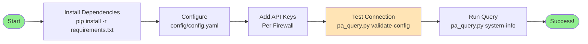

---

## Command Workflow

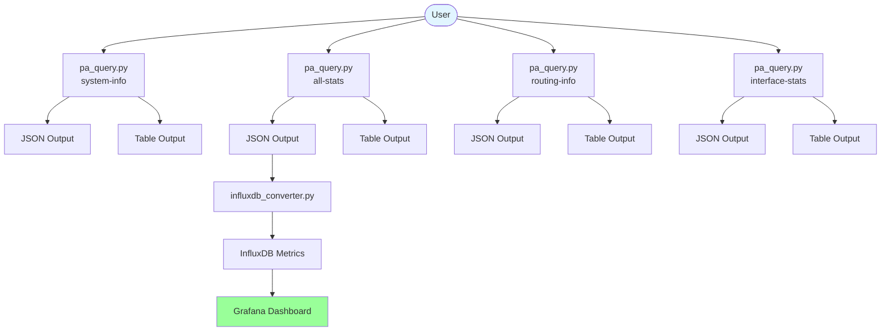

---

## Multi-Firewall Collection

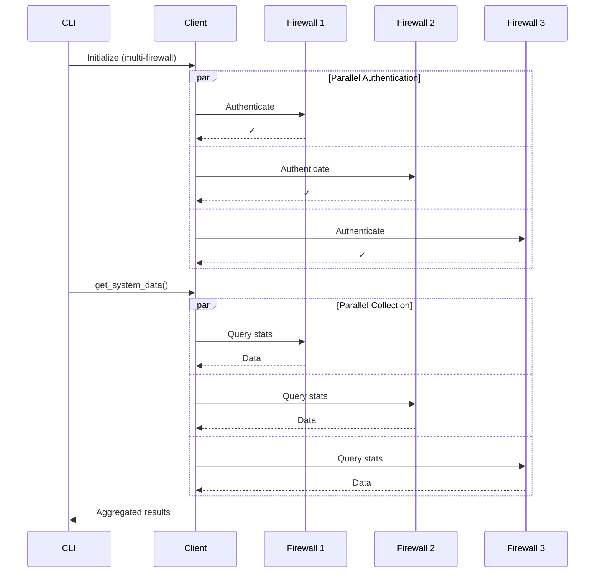

---

## Data Transformation Pipeline

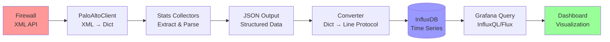

---

## Configuration Structure

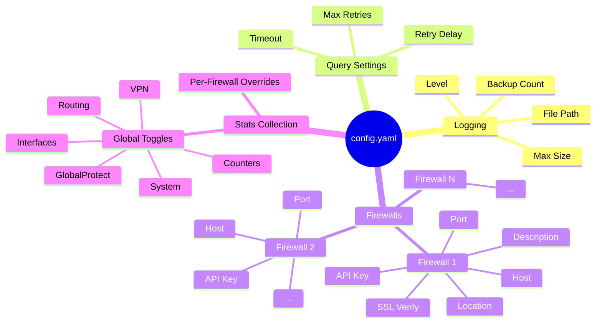

---

## Stats Module Coverage

**Note:** For detailed measurement specifications, see `docs/influxdb_measurements.md` (42 measurements total).

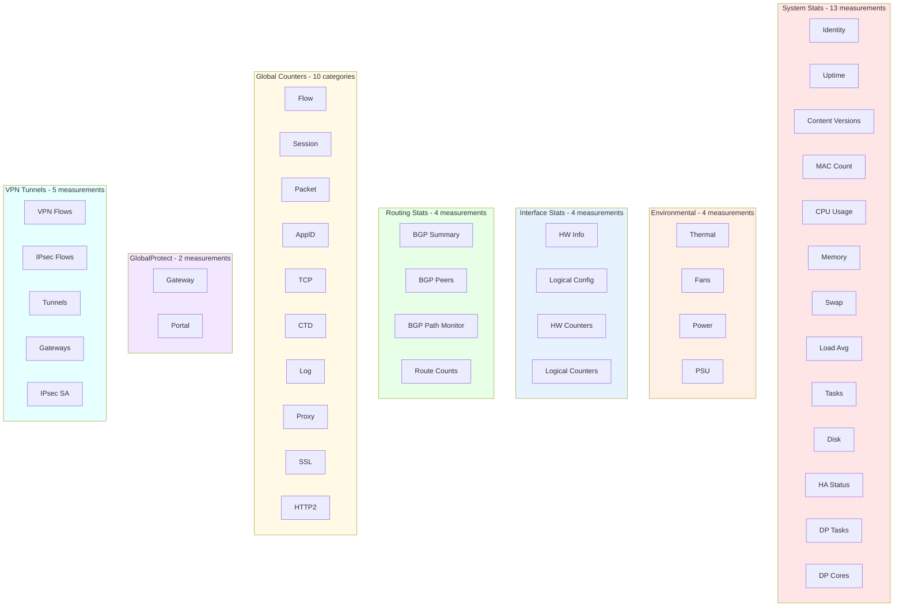

---

## Deployment Patterns

### Pattern 1: Direct CLI Collection
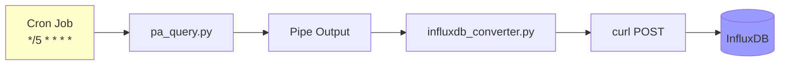

### Pattern 2: File-Based Collection
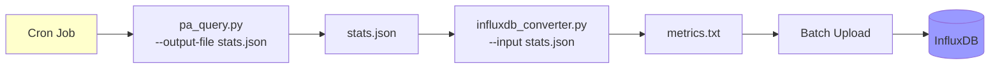

### Pattern 3: Container-Based Collection
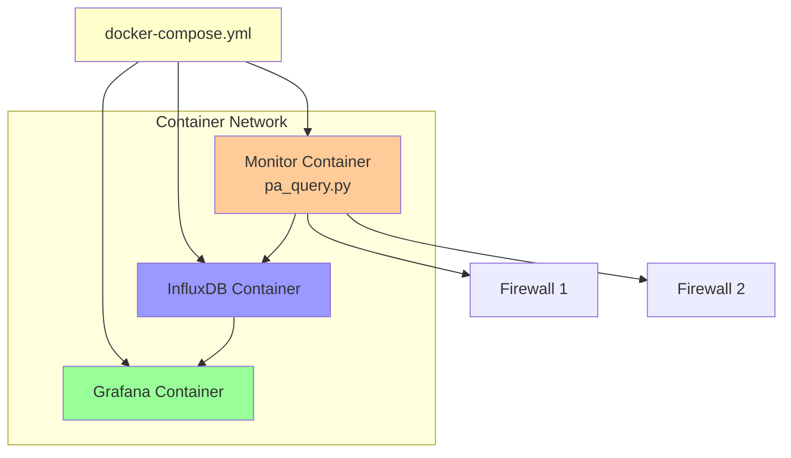

---

## Error Handling Flow

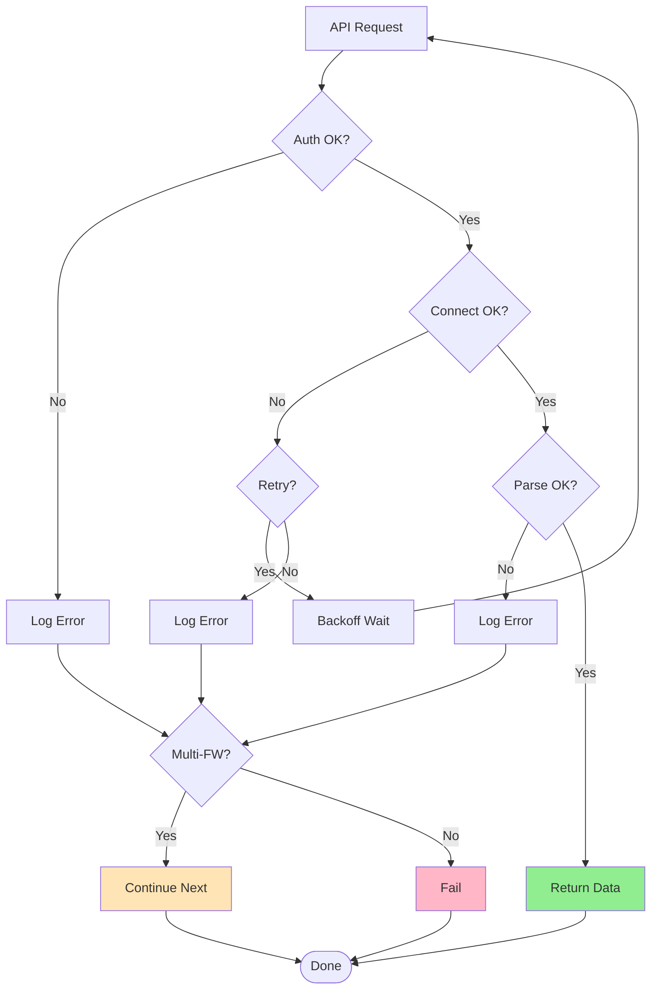

---

## Typical Grafana Dashboard Layout

```mermaid
graph TB
    subgraph Dashboard["Palo Alto Firewall Dashboard"]
        subgraph Row1["System Overview"]
            P1[CPU Usage]
            P2[Memory Usage]
            P3[Load Average]
            P4[Uptime]
        end
        
        subgraph Row2["Network Traffic"]
            P5[Interface Bandwidth]
            P6[Packet Rates]
            P7[Error Rates]
        end
        
        subgraph Row3["Security"]
            P8[Threat Counters]
            P9[Session Count]
            P10[URL Filter Stats]
        end
        
        subgraph Row4["BGP Routing"]
            P11[Peer Status]
            P12[Prefix Counts]
            P13[Path Monitor]
        end
        
        subgraph Row5["VPN"]
            P14[GlobalProtect Users]
            P15[IPSec Tunnels]
            P16[VPN Flows]
        end
    end
    
    INFLUX[(InfluxDB)] --> P1
    INFLUX --> P2
    INFLUX --> P3
    INFLUX --> P4
    INFLUX --> P5
    INFLUX --> P6
    INFLUX --> P7
    INFLUX --> P8
    INFLUX --> P9
    INFLUX --> P10
    INFLUX --> P11
    INFLUX --> P12
    INFLUX --> P13
    INFLUX --> P14
    INFLUX --> P15
    INFLUX --> P16
    
    style Dashboard fill:#f0f0f0
    style INFLUX fill:#9999ff
```

---

## Common Use Cases

### Use Case 1: Monitor Single Firewall
```bash
# Configure single firewall in config.yaml
python pa_query.py --firewall primary system-info
```

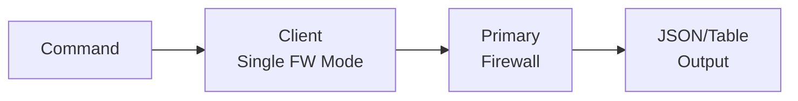

### Use Case 2: Monitor All Firewalls
```bash
# All firewalls configured in config.yaml
python pa_query.py all-stats
```

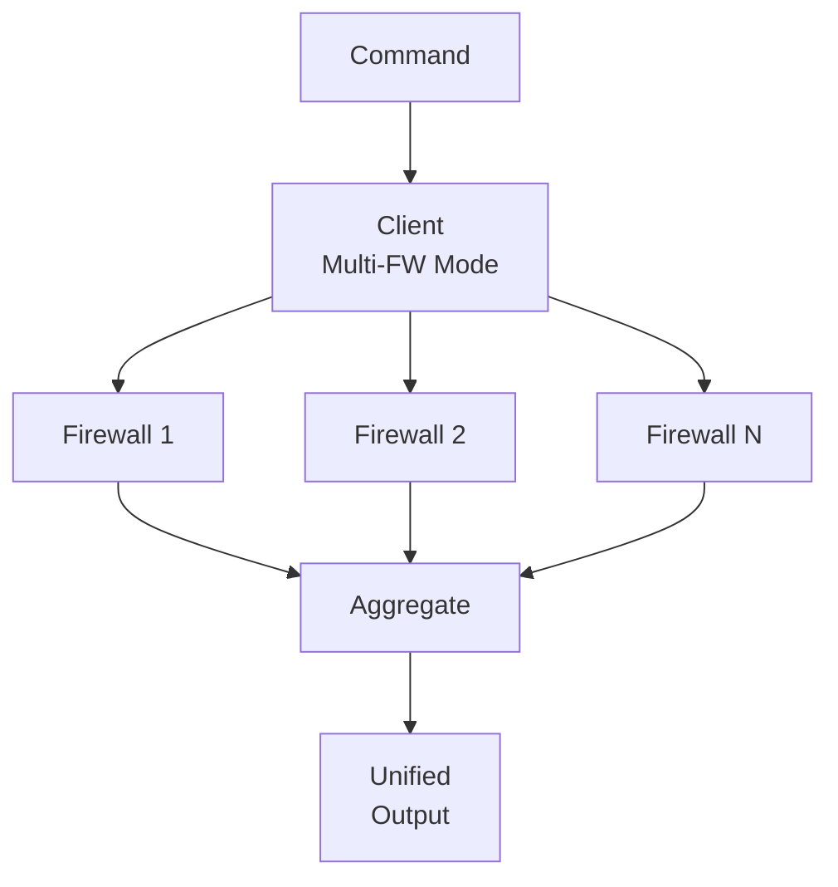

### Use Case 3: Send to InfluxDB
```bash
# Collect and send to InfluxDB with Curl
python pa_query.py -o json all-stats | \
  python influxdb_converter.py | \
  curl -XPOST 'http://influxdb:8086/write?db=telegraf' \
  --data-binary @-
```

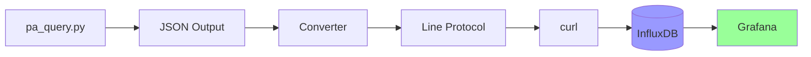

### Use Case 4: Validate Configuration
```bash
# Test all firewall connections
python pa_query.py validate-config
```

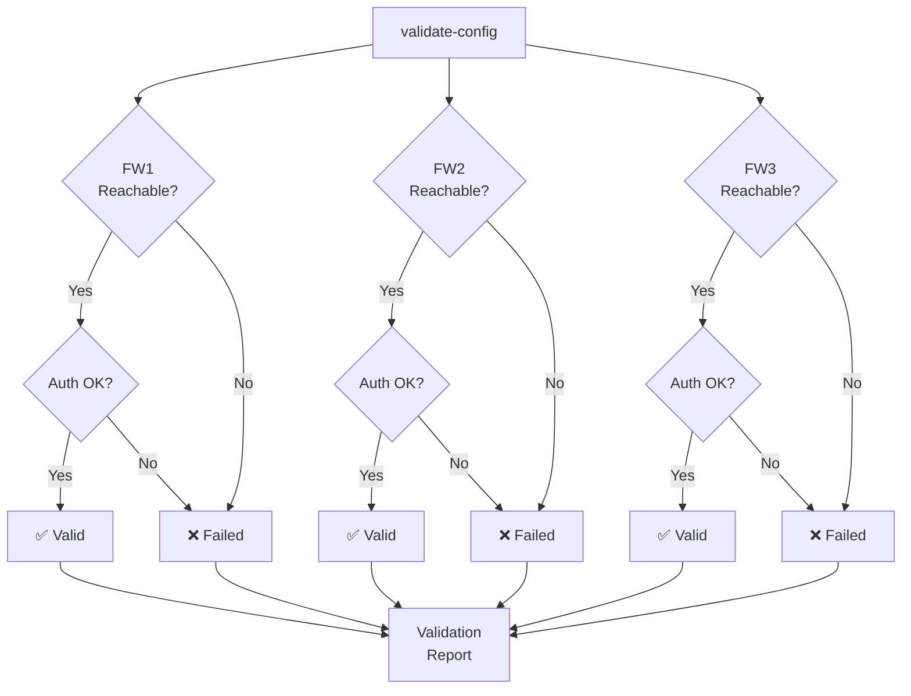

---


## Quick Troubleshooting

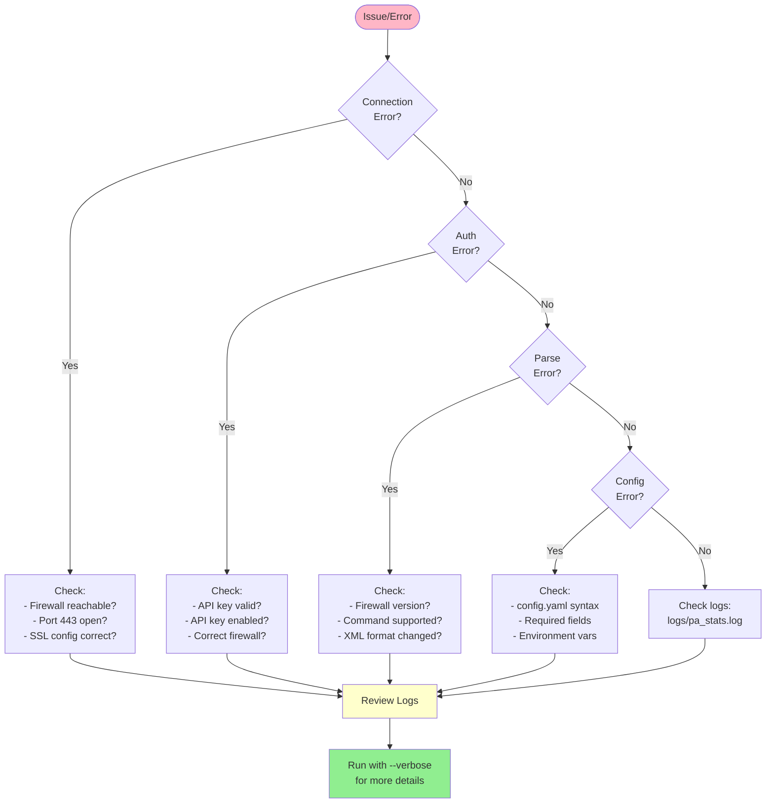

---

## Data Flow Summary

```
Firewalls (XML API)
         ↓
   PaloAltoClient (Authentication, XML parsing)
         ↓
   Stats Collectors (Data extraction)
     - SystemStats (13 system + 4 environmental)
     - InterfaceStats (4 measurements)
     - RoutingStats (4 measurements)
     - GlobalCounters (10 categories)
     - GlobalProtectStats (2 measurements)
     - VpnTunnelStats (5 measurements)
         ↓
   JSON Output (Structured data)
         ↓
   InfluxDB Converter (42 measurements → Line protocol)
         ↓
   InfluxDB (Time-series storage)
         ↓
   Grafana (Visualization)
         ↓
   User (Monitoring & Alerts)
```

---

## Next Steps

For detailed documentation, see:
- `README.md` - Main project documentation
- `docs/architecture.md` - Comprehensive architecture details
- `tests/README.md` - Testing documentation
- `config/config.yaml.example` - Configuration examples

